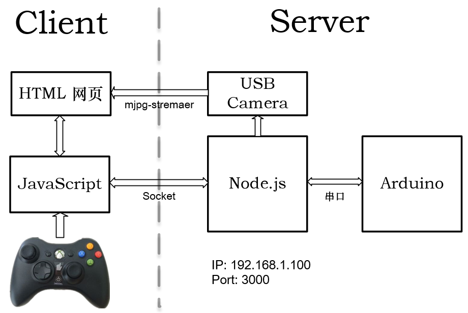
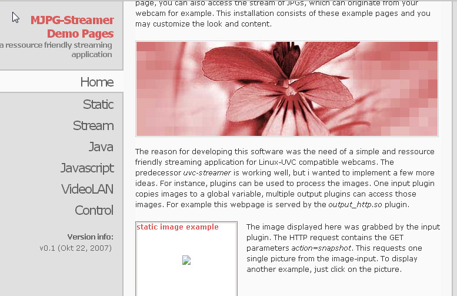

# ROV 服务器端程序 ROV_Control 说明文档


# 一、基本框架说明

本工程使用基于 JavaScript 语言的 Node.js 平台，配合 socket.io + express + serialport ，构建了该项目的基本框架。

## 1. Node.js
Node.js 是一套用来编写高性能网络服务器的 JavaScript 工具包。Node.js 是一个可以快速构建网络服务及应用的平台，该平台的构建是基于 Chrome's JavaScript runtime，也就是说，实际上它是对 GoogleV8 引擎（应用于 Google Chrome浏览器）进行了封装。
简要介绍 Node.js 的优点如下：

- 基于Google V8虚拟机，可构建高性能服务器；
- 单线程：
	-   Node.js 可以在不新增额外线程的情况下，依然可以对任务进行并行处理 —— Node.js 是单线程的。它通过事件轮询 (event loop) 来实现并行操作，对此，我们应该要充分利用这一点 —— 尽可能的避免阻塞操作，取而代之，多使用非阻塞操作。
- 可利用 JavaScript 进行后台开发：
	- 虽然让 Javascript 运行于服务器端不是Node的独特之处，但却是其一强大功能。不得不承认，浏览器环境限制了我们选择编程语言的自由。任何服务器与日益复杂的浏览器客户端应用程序间共享代码的愿望只能通过 Javascript 来实现。虽然还存在其他一些支持 Javascript 在服务器端运行的平台，但因为上述特性，Node 发展迅猛，成为事实上的平台。
- 非阻塞 IO：
	- Node 采用一系列“非阻塞”库来支持事件循环的方式。本质上就是为文件系统、数据库之类的资源提供接口。向文件系统发送一个请求时，无需等待硬盘（寻址并检索文件），硬盘准备好的时候非阻塞接口会通知 Node 。该模型以可扩展的方式简化了对慢资源的访问， 直观，易懂。

## 2. 用到的 Package
JavaScript 可以使用 <code>require()</code>语句获得其他的代码包（一般被称为 Package），实现源代码的模块化。本项目主要用到的 Package 有：

### (1) Express
Express 是一个简洁而灵活的 Node.js Web应用框架，提供了一系列强大特性帮助你创建各种 Web 应用，以及丰富的 HTTP 工具。本项目选择 Express 的原因，是在于使用 Express 可以快速地搭建一个完整功能的网站。
Express 框架核心特性：

-  可以设置中间件来响应 HTTP 请求。
-  定义了路由表用于执行不同的 HTTP 请求动作。
-  可以通过向模板传递参数来动态渲染 HTML 页面。

在该项目中安装 express，只需要在该项目根目录下（即 ROV_Control ）终端中输入：
```shell
npm install express --save
```
之后 express 就会安装到当前目录下的 node_modules 目录中，node_modules 目录下会自动创建 express 目录。
### (2) socket.io
> Socket.IO enables real-time bidirectional event-based communication. It works on every platform, browser or device, focusing equally on reliability and speed. 
> Socket.IO 支持实时双向事件通信，它适用于所有平台、浏览器以及设备，对可靠性和运行速度同等重视。
——摘自[ Socket.IO 官网 ](https://socket.io/)

简要介绍 socket.io 之前首先要说到 websocket：在 HTML5 中存在着这样的一个新特性，即引入了 websocket，这个特性提供了<strong><font color = red>浏览器端和服务器端的基于TCP连接的双向通道</font></strong>。但是并不是所有的浏览器都支持 websocket 特性，故为了磨平浏览器间的差异，为开发者提供统一的接口，引入了 socket.io 模块。在不支持 websoket 的浏览器中，socket.io 可以降级为其他的通信方式，比如有 AJAX long polling ，JSONP Polling 等。

### (3) Node-Serialport
> Node-Serialport provides a stream interface for the low-level serial port code necessary to controll Arduino chipsets, X10 interfaces, Zigbee radios, highway signs, lcd screens, cash drawers, motor controllers, sensor packages, fork lifts, modems, drones, CNC machines, plotters, vending machines, ccTalk coin accecptors, SMS Gateways, RFID scanners and much more. If if you have a hardware device with an UART we can speak to it. 
> Node-Serialport 为底层串口流接口提供了必要的代码，用来控制各带有可以读取的 UART 硬件设备（包括 Arduino 芯片组，X10 接口，Zigbee 收音机，公路标志，液晶屏幕，抽屉，电机控制器，传感器包，叉车，调制解调器，无人机，数控机床，绘图仪，自动售货机，ccTalk 硬币接收器，SMS 网关，RFID 扫描仪等）。
> ——摘自[ Node-Serialport 的 GitHub 说明文档 ](https://github.com/EmergingTechnologyAdvisors/node-serialport/blob/master/README.md)

本项目调用 Node-Serialport 的 Package，实现服务器端、客户端通过串口与其他外设（XBox-ONE 控制器，以及 Arduino 下位机，其中 XBox-ONE 尚未测试实现）的通讯。

# 二、软件框图
该项目运用B/S架构，服务器端 (S) 是ROV上的主控板，上面运行服务程序，并打开一个端口为局域网下的其他用户打开服务入口；浏览器端 (B) 是与ROV同一局域网段下其他设备（PC  / 手机 / 平板电脑）上的浏览器，在浏览器中输入服务器端的网址与端口即可访问该服务。软件框图如下所示：

注：目前除了Xbox控制器，其余部分都已经测试完毕，可以实现各部分之间的连接。

# 三、目录结构
以该项目所在路径为根目录，目录结构如下：

- lib：存放对某些Pacakges进行二次封装的源码；
	- Camera.js：使用spawn模块，实现服务器自行开启 mjpg-streamer 的方法模块；
	- DataReader.js：解析数据的方法模块（多数内容待开发）；
	- 	SerialPort.js：调用 Node-SerialPort 模块，实现读取串口数据的模块；
- 	mjpg-streamer：mjpg-streamer 视频流的源码，以及生成的库函数；
- 	node_modules：存放运行 Node.js 程序的依赖包；
- 	src：存放一系列在网上找到的 jquery, socket.io 源码，也许会用到；
- 	app.js：服务器程序，用 node 指令运行该文件，服务器程序便执行；
- 	Client.js：存放客户端网页需要的部分源码；
- 	index.html：进入端口服务后的页面，即为服务器程序运行后，客户端连接的有效页面；
- 	package.json：存放部分 Node.js 程序依赖包的版本信息；
- 	package-lock.json：存放部分 Node.js 程序依赖包的版本信息；

# 四、硬件设备
## 1. 服务器端
### (1) BeagleBone Black
运行服务器端的设备是开源电路板 BeagleBone Black（简称 BBB ），其上运行的是 Linux 系统。部分参数如下：

- AM335x 1GHz ARM® Cortex-A8处理器
- 多种 Linux 系统的 Distribution (Angstrom / Ubuntu / Debian等)
- 512MB DDR3 RAM
- 4GB 8-bit eMMC板载闪存
- 3D 图像加速器
- NEON 浮点加速器
- 2x PRU 32 位处理器

笔者并不是直接在 BBB 上直接开发的，由于 BBB 上运行的 Angstrom 也是 Linux 内核，所以笔者直接在自己装有 Ubuntu (Linux)的 PC 端进行开发。笔者的实际开发环境部分参数如下：

- 操作系统：Ubuntu 14.04 LTS (64-bit)
- 8核CPU：Intel® Core™ i7-4790 CPU @ 3.60 GHz
- 内存：8GB
- 开发IDE：WebStorm 2017.3
- Node.js 版本：8.4.0

### (2) Arduino
Arduino 部分作为下位机，用于控制执行机构。
笔者开发测试时，并没有用到 Arduino 的实机，用的是在 Linux 系统下的 socat 指令生成的虚拟串口。笔者测试串口时实际操作如下：
在 Linux 系统终端输入如下指令运行：
```sh
socat -d -d pty,raw,echo=0 pty,raw,echo=0
```
指令运行后，会生成类似于下面的提示信息：
<code>
2014/05/23 14:56:05 socat[2220] N PTY is /dev/pts/1
2014/05/23 14:56:05 socat[2220] N PTY is /dev/pts/3
2014/05/23 14:56:05 socat[2220] N starting data transfer loop with FDs [3,3] and [5,5]
</code>
其中，/dev/pts/1 与 /dev/pts/3 即为该指令生成的一对虚拟串口。生成虚拟串口后，可以在该项目根目录下的 ./lib/SerialPort.js 文件中更改变量 var portPath 为上面生成的虚拟串口地址，然后就可以继续后面的测试功能。
### (3) USB摄像机
笔者用了 USB 摄像机作为输入流。USB 摄像机并没有特别的需求，从一般的商家购买一般都可以实现功能。
USB 摄像机插入到运行着 Linux 系统的主机上后，一般在/dev路径下会出现类似的文件： /dev/video0 ，该文件即为该 USB 摄像机的路径。在服务器端，该项目根目录下， ./lib/Camera.js 中的变量 var cameraPath 即为 USB 摄像机的路径。
该项目中 USB 摄像机的视频流是用 mjpg-streamer 运行，并实现在网页上显示的功能。笔者已经将 mjpg-streamer 放在了该项目根目录下，但该路径下的库文件是由笔者主机的编译器生成的，也许在 BBB 中不能直接使用，这时候就需要交叉编译生成 BBB 的库文件，或者是直接在 BBB 中编译生成其所需要的库文件了。完整步骤如下：

- 安装 mjpg-stremaer 也许需要在之前安装 jpeg 库，首先需要在网上下载 jpeg 的源码，下载地址如下： http://www.ijg.org/files/
- 下载jpeg源码完毕后，执行如下指令进行安装：
```sh
tar zxvf jpegsrc.v8b.tar.gz  
./configure
make
make install
```
- 在网上获取 mjpg-streamer 的源代码（笔者已经将源码放在了该项目根路径下，故此步骤可以省略）；(https://sourceforge.net/projects/mjpg-streamer/)
- 将 mjpg-streamer 解压到某路径后，执行后续的命令：
```sh
tar zxvf mjpg-streamer-r63.tar.gz
make
```
- 待生成了文件 input_uvc.so, output_http.so 之后，即可再执行后面的命令：
./mjpg-streamer –i “input_uvc.so –y –f 15” –o “output_http.so –w ./www –p 8080”

- -i 后是与输入相关的参数，-o 后是与输出相关的参数。对参数的解释如下：

	- -y：使用 YUV 格式输出；若不输入该参数，则使用默认的 mjpg 格式；
	- -f：帧率，后面的参数即为帧率值，该例指帧率为15 fps；
	- -w：若使用 http 形式输出，则 -w 参数给出网页相关资源的地址；
	- -p：若使用 http 形式输出，则 -p 参数给出 mjpg-streamer 的服务端口号；

- 其中 –p 后连接的数字是 mjpg-streamer 服务的端口号，执行后即可在浏览器中输入运行 mjpg-streamer 的主机 IP 与端口号即可。举例：若运行 mjpg-streamer 的主机是10.129.48.230，运行 mjpg-streamer 的端口是 8080 ，则在浏览器中输入网址 http://10.129.48.230:8080，即可看到如下的页面：


以上即为 mjpg-streamer 的常规启动方式。但实际运用中并不需要这样启动 mjpg-streaer，笔者通过 spawn 模块的功能，实现了在服务器端程序中直接运行 mjpg-streamer 的功能。具体实现可以见源码。

## 2. 浏览器端
浏览器端是与 ROV 同一局域网段下其他设备（PC  / 手机 / 平板电脑）上的浏览器。
笔者测试时的环境是连接在一个局域网下的，其中运行服务器端的主机IP为 10.129.48.230 ，服务器端占用的端口号为 3000 ，则只需要在浏览器地址栏输入地址：http://10.129.48.230:3000 ，即可与服务器端连接，进行后面的操作。

## 3. 桥接设备
以笔者的测试环境为例：笔者用来测试的网络环境是在一个局域网网段之下的，该网段的网关是 10.129.48.1 ，其下的各主机都是通过一个交换机连接的。
运行服务器端程序的主机（即笔者的主机）IP是 10.129.48.230 ，所以在该网段下的其他主机，即10.129.48.x （x ≠ 1, 230, 255）都可以通过浏览器访问该服务器程序，默认地址就是http://10.129.48.230:3000 。

# 五、后记
该项目主要参考了 OpenROV 的设计理念与挪威科技大学 (Norwegian University of Science and Technology) 的产品 ROV Neptunus 设计框架。部分相关材料见文件《Design and Implementation of Software for the ROV Neptunus》。
目前该项目只是在 Linux 64bit 环境中开发，以后移植到 BeagleBone Black 开发板时，很可能会遇到交叉编译的问题，此时就需要多研究一下交叉编译的内容。下面给出笔者写的交叉编译心得网址，以及在网上找到的介绍交叉编译 Node-SerialPort 的网址如下：

[《Ubuntu 14.04 LTS下使用arm-linux-gcc交叉编译OpenCV 2.4.9》](http://blog.csdn.net/ajianyingxiaoqinghan/article/details/70194392)

[《交叉编译学习笔记（一）——交叉编译和交叉工具链》](http://blog.csdn.net/ajianyingxiaoqinghan/article/details/70917569)

[《交叉编译学习笔记（二）——交叉编译器的命名规则》](http://blog.csdn.net/ajianyingxiaoqinghan/article/details/70941600)

[《ARM交叉编译OpenCV错误总结》](http://blog.csdn.net/ajianyingxiaoqinghan/article/details/71155560)

[《Install node-serialport module on arm-linux》](https://stackoverflow.com/questions/24638063/install-node-serialport-module-on-arm-linux)

该项目目前只是实现了整体框架的构建，后续过程中仍需要向其中填写内容，并进行调试。后续开发可以在网上找具体资料，或者联系笔者。
